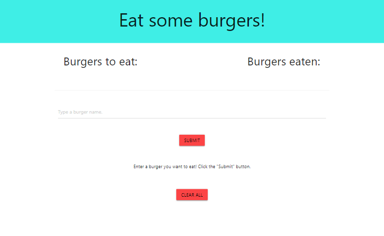
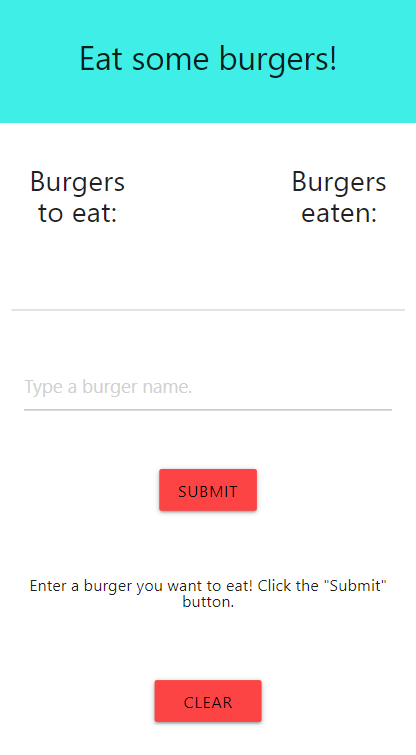

#  Eat the Burger

This app takes names of burgers and saves them to a database.  Then you can virtually eat the burgers and the database record will be updated and the item moved to a different list.

 
 

## Table of Contents

* [Installation](#Installation)
* [Usage](#Usage)
* [License](#License)
* [Contributing](#Contributing)
* [Tests](#Tests)
* [Questions](#Questions)

 
 

## Deployed Application

Open a web browser and browse to https://polar-hamlet-57397.herokuapp.com/  
(The application may take 15 seconds to respond if the website hasn't been visited recently.)

 
 

## Installation

This project requires nodejs and MySql.  Clone the repository and install the npm dependencies. To start the application, open a terminal window in the root folder of the repository and type 'node server.js'.  Then you should be able to browse to the URL configured in the connection.js file.

 
 

## Usage

Type the name of the burger into the input box and then click submit.  After the burger is added to the list, you can click the 'Devour It' button to 'eat' the burger.

 
 

## Screenshot Desktop

 
 

## Screenshot Mobile

 
 

## License

[MIT](https://choosealicense.com/licenses/mit/)

 
 

## Contributing

If you would like to contribute to this project, please open an issue and fork the repository.

 
 

## Tests

No tests have been written.

 
 

## Questions  

If you have questions about the project you can email me, or you can open an issue in the GitHub repository.

My GitHub profile is [benjDG](https://github.com/benjDG)  
  
Email: bdgalloway85@gmail.com.  
